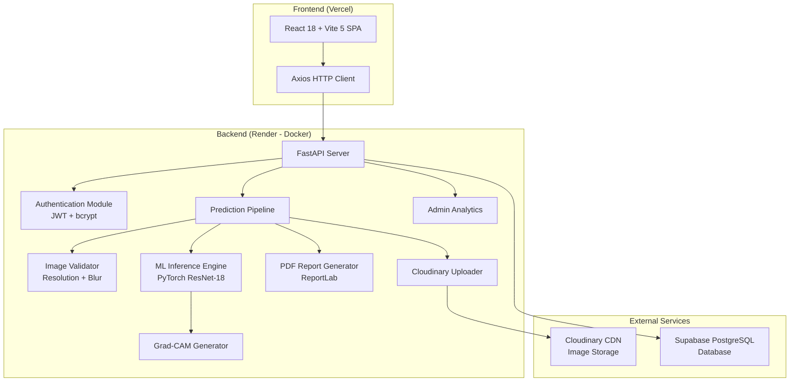
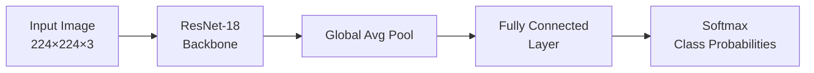
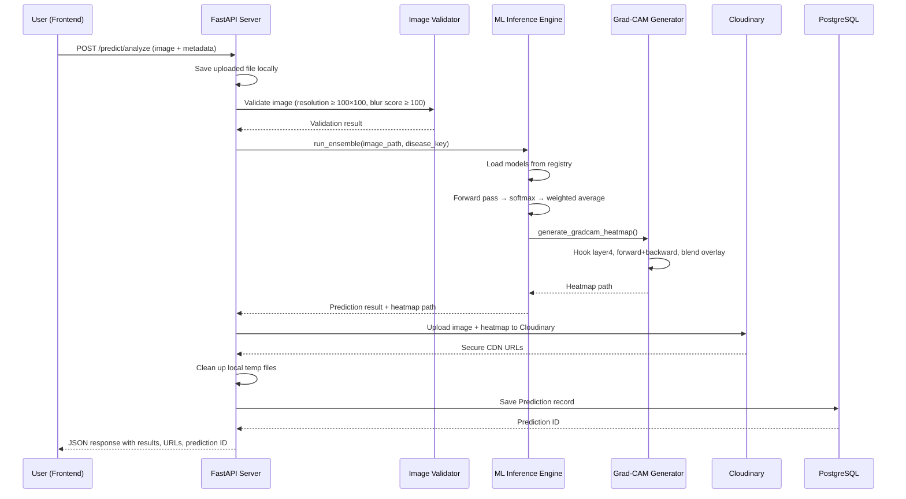
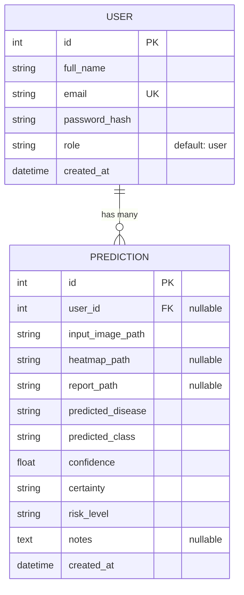
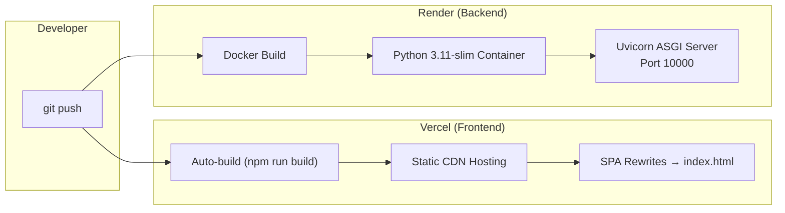

# BloodDetect AI — Medical Image Diagnosis System
## Comprehensive Project Specification

---

## 1. Project Overview

**BloodDetect AI** is a full-stack, AI-powered medical image diagnosis system designed as a capstone project. It enables automated detection and classification of diseases from **microscopic blood smear images** and **chest X-ray radiographs** using deep learning. The system provides real-time predictions with explainability through Grad-CAM heatmaps, generates professional PDF diagnostic reports, and maintains a complete history of all analyses.

### 1.1 Diseases Supported

| # | Disease Category | Image Type | Classification Classes |
|---|---|---|---|
| 1 | **Malaria** | Microscopic blood smear | `Parasitized`, `Uninfected` |
| 2 | **Anemia** | Microscopic RBC smear | `Anemic`, `Normal` |
| 3 | **Leukemia** | Microscopic WBC smear | `Benign`, `Early`, `Pre`, `Pro` |
| 4 | **Lung X-Ray** | Chest radiograph | `Normal`, `Pneumonia`, `Tuberculosis` |
| 5 | **Disease Router** | Any of the above | `anemia_rbc`, `invalid`, `leukemia_wbc`, `malaria_rbc` |

### 1.2 Key Capabilities

- Upload and validate medical images (microscopic slides or X-rays)
- Automatic disease classification with confidence scoring
- Grad-CAM visual explainability heatmaps
- Dynamic PDF diagnostic report generation
- Patient-level prediction history with search and filtering
- Dashboard with real-time analytics and pie chart visualization
- Cloud-based media storage (Cloudinary) and database (Supabase PostgreSQL)
- Full-stack deployment: backend on **Render**, frontend on **Vercel**

---

## 2. System Architecture



### 2.1 Architecture Pattern

- **Frontend**: Single-Page Application (SPA) with client-side routing
- **Backend**: RESTful API with layered architecture (Routes → Services → ML → DB)
- **Communication**: HTTP REST over JSON + `multipart/form-data` for image uploads
- **Deployment**: Containerized backend (Docker) + Static frontend hosting

---

## 3. Technology Stack

### 3.1 Backend Technologies

| Technology | Version | Purpose |
|---|---|---|
| **Python** | 3.11 | Core runtime |
| **FastAPI** | Latest | Async web framework with automatic OpenAPI docs |
| **PyTorch** | Latest | Deep learning inference engine |
| **TorchVision** | Latest | Pre-trained model architectures (ResNet-18, MobileNetV3, EfficientNet-B0) |
| **SQLAlchemy** | Latest | ORM for database operations |
| **Pydantic** + **Pydantic Settings** | Latest | Request/response validation & environment config |
| **python-jose** | Latest (with cryptography) | JWT token creation and verification |
| **passlib** | Latest (with bcrypt) | Password hashing |
| **Pillow** | Latest | Image loading and manipulation |
| **NumPy** | Latest | Numerical computation |
| **Matplotlib** | Latest | Grad-CAM heatmap visualization rendering |
| **ReportLab** | Latest | PDF report generation |
| **Cloudinary** | Latest | Cloud media storage SDK |
| **psycopg2-binary** | Latest | PostgreSQL database adapter |
| **Uvicorn** | Latest (standard) | ASGI server |
| **python-multipart** | Latest | File upload handling |
| **email-validator** | Latest | Email format validation |

### 3.2 Frontend Technologies

| Technology | Version | Purpose |
|---|---|---|
| **React** | 18.3.1 | UI component library |
| **React DOM** | 18.3.1 | DOM rendering |
| **React Router DOM** | 6.26.1 | Client-side routing |
| **Axios** | 1.7.2 | HTTP client for API communication |
| **Recharts** | 2.12.7 | Data visualization (pie charts) |
| **Vite** | 5.4.2 | Build tool and dev server |
| **@vitejs/plugin-react** | 4.3.1 | React JSX transform for Vite |

### 3.3 Cloud & Infrastructure

| Service | Purpose |
|---|---|
| **Supabase (PostgreSQL)** | Production database hosting (AWS ap-northeast-1) |
| **Cloudinary** | Cloud image/media CDN storage |
| **Render** | Backend Docker container hosting with auto-deploy |
| **Vercel** | Frontend static SPA hosting with SPA rewrites |
| **Docker** | Backend containerization (Python 3.11-slim base) |
| **Git/GitHub** | Version control & CI/CD triggers |

---

## 4. Machine Learning Pipeline

### 4.1 Model Architecture

All models use **ResNet-18** (Residual Network with 18 layers), a convolutional neural network architecture:



- **Architecture Builder**: `torchvision.models.resnet18(weights=None)` with custom `fc` layer
- **Input Preprocessing**:
  - Resize to **224 × 224** pixels
  - Convert to tensor
  - Normalize with ImageNet mean `[0.485, 0.456, 0.406]` and std `[0.229, 0.224, 0.225]`
- **Output**: Softmax probability distribution across disease-specific classes

### 4.2 Model Registry System

Models are managed through a JSON registry ([registry.json](file:///e:/capstone/updated/cap_software_2.0/backend/app/ml/registry.json)) that defines:

| Field | Description |
|---|---|
| `display_name` | Human-readable disease name |
| `builder` | Architecture function to use (`resnet18`, `mobilenet_v3_small`, `efficientnet_b0`) |
| `weights_path` | Path to trained `.pth` weight file |
| `class_names` | Ordered list of classification labels |
| `weight` | Ensemble weighting factor (currently 1.0 for single-model configs) |

**Registered Models** (5 total, ~44.8 MB each):

| Model File | Disease | Classes | Size |
|---|---|---|---|
| `resnet18_router_best.pth` | Disease Router | 4 classes | 44.8 MB |
| `resnet18_malaria.pth` | Malaria | 2 classes | 44.8 MB |
| `resnet18_leukemia_corrected.pth` | Leukemia | 4 classes | 44.8 MB |
| `resnet18_anemia.pth` | Anemia | 2 classes | 44.8 MB |
| `resnet18_lung.pth` | Lung X-Ray | 3 classes | 44.8 MB |

### 4.3 Model Loading & Caching

The [RegistryModelLoader](file:///e:/capstone/updated/cap_software_2.0/backend/app/ml/model_loader.py#L29-L52) class handles:

1. Reads registry JSON configuration
2. Instantiates the correct architecture via builder functions
3. Loads pre-trained weights from `.pth` files using `torch.load()`
4. Switches model to `eval()` mode for inference
5. Supports multiple architectures: ResNet-18, MobileNetV3-Small, EfficientNet-B0

### 4.4 Weighted Ensemble Inference

The [run_ensemble](file:///e:/capstone/updated/cap_software_2.0/backend/app/ml/inference.py#L140-L181) function implements:

1. Load all models registered for the specified disease
2. Run forward pass through each model
3. Apply **softmax** to get probability distributions
4. Compute **weighted average** of probabilities across models
5. Select the class with the **highest weighted probability** as the prediction
6. Generate Grad-CAM heatmap using the last loaded model

### 4.5 Grad-CAM (Gradient-weighted Class Activation Mapping)

The [generate_gradcam_heatmap](file:///e:/capstone/updated/cap_software_2.0/backend/app/ml/inference.py#L47-L137) function provides model explainability:

**Algorithm**:
1. Register **forward** and **backward hooks** on ResNet-18's `layer4` (final conv block)
2. Perform a forward pass to capture feature map activations
3. Perform backward pass from the predicted class score to compute gradients
4. Compute weights via **Global Average Pooling** of gradients over spatial dimensions
5. Generate weighted sum of activation maps → apply **ReLU** → normalize to [0, 1]
6. Resize the activation map to original image dimensions using bilinear interpolation
7. Apply **jet colormap** and blend with original image (55% heatmap / 45% original)
8. Render a **3-panel matplotlib figure**: Original Image | Grad-CAM Activation | Overlay

**Output**: High-resolution PNG (150 DPI) saved to `storage/heatmaps/`

### 4.6 Confidence & Risk Assessment

| Metric | Logic |
|---|---|
| **Certainty Level** | ≥85% → `High`, ≥60% → `Medium`, <60% → `Low` |
| **Risk Level** | Healthy classes → `Low Risk`; ≥90% confidence → `High Risk`; ≥70% → `Moderate Risk`; else → `Review Needed` |
| **Clinical Suggestion** | Auto-generated text based on risk level, always recommending professional consultation |

---

## 5. Backend API Specification

### 5.1 API Endpoints

#### Authentication Routes (`/auth`)

| Method | Endpoint | Description | Request Body | Response |
|---|---|---|---|---|
| `POST` | `/auth/register` | Register new user | `{ full_name, email, password }` | `{ access_token, token_type }` |
| `POST` | `/auth/login` | Login existing user | `{ email, password }` | `{ access_token, token_type }` |

#### Prediction Routes (`/predict`)

| Method | Endpoint | Description | Request | Response |
|---|---|---|---|---|
| `POST` | `/predict/analyze` | Upload image & run AI analysis | `multipart/form-data` with `file`, `disease_key`, `patient_name`, `user_id` | Full prediction result with probabilities, heatmap URL, report URL |
| `GET` | `/predict/history` | Get all prediction history | Optional query: `user_id` | Array of prediction records |
| `GET` | `/predict/history/{id}` | Get single prediction details | Path param: `prediction_id` | Detailed prediction record with input image path |
| `GET` | `/predict/report/{id}` | Download PDF report | Path param: `prediction_id` | PDF file (dynamically generated, auto-deleted after serving) |

#### Admin Routes (`/admin`)

| Method | Endpoint | Description | Response |
|---|---|---|---|
| `GET` | `/admin/summary` | Dashboard analytics summary | `{ total_predictions, malaria_cases, anemia_cases, leukemia_cases, lung_cases, normal_cases, disease_breakdown, model_accuracy }` |

#### Static File Routes

| Mount Path | Serves From | Content |
|---|---|---|
| `/static/uploads/` | `storage/uploads/` | Uploaded patient images |
| `/static/reports/` | `storage/reports/` | Generated PDF reports |
| `/static/heatmaps/` | `storage/heatmaps/` | Grad-CAM heatmap images |

### 5.2 Prediction Workflow (End-to-End)



### 5.3 CORS Configuration

- **Allowed Origins**: `*` (all origins)
- **Allowed Methods**: All
- **Allowed Headers**: All
- **Credentials**: Enabled

---

## 6. Database Schema

### 6.1 Database Configuration

- **Production**: Supabase PostgreSQL (AWS ap-northeast-1 region)
- **Development fallback**: SQLite (`blooddetect.db`)
- **ORM**: SQLAlchemy with `declarative_base`
- **Auto-migration**: `Base.metadata.create_all()` on startup

### 6.2 Entity-Relationship Diagram



### 6.3 Table Details

#### `users` Table
| Column | Type | Constraints | Description |
|---|---|---|---|
| `id` | Integer | PK, Auto-increment | Unique user identifier |
| `full_name` | String(120) | NOT NULL | User's full name |
| `email` | String(150) | UNIQUE, NOT NULL, Indexed | Login email |
| `password_hash` | String(255) | NOT NULL | bcrypt-hashed password |
| `role` | String(50) | NOT NULL, Default: `"user"` | Authorization role |
| `created_at` | DateTime | Default: `utcnow()` | Registration timestamp |

#### `predictions` Table
| Column | Type | Constraints | Description |
|---|---|---|---|
| `id` | Integer | PK, Auto-increment | Unique prediction ID |
| `user_id` | Integer | FK → `users.id`, Nullable | Associated user |
| `input_image_path` | String(255) | NOT NULL | Cloudinary URL or local path |
| `heatmap_path` | String(255) | Nullable | Grad-CAM heatmap URL |
| `report_path` | String(255) | Nullable | PDF report endpoint path |
| `predicted_disease` | String(100) | NOT NULL | Disease category (e.g., "Malaria") |
| `predicted_class` | String(100) | NOT NULL | Specific class (e.g., "Parasitized") |
| `confidence` | Float | NOT NULL | Model confidence score (0–1) |
| `certainty` | String(20) | NOT NULL | High / Medium / Low |
| `risk_level` | String(20) | NOT NULL | Risk assessment label |
| `notes` | Text | Nullable | Patient name and notes |
| `created_at` | DateTime | Default: `utcnow()` | Prediction timestamp |

---

## 7. Authentication & Security

### 7.1 Password Security
- **Hashing Algorithm**: bcrypt (via `passlib.context.CryptContext`)
- **Password Storage**: Only bcrypt hashes stored; plaintext never persisted

### 7.2 JWT Authentication
- **Library**: `python-jose` with cryptography backend
- **Algorithm**: HS256
- **Token Expiry**: 24 hours (configurable via `ACCESS_TOKEN_EXPIRE_MINUTES`)
- **Token Payload**: `{ sub: user_id, exp: expiry_timestamp }`

### 7.3 Environment Configuration
- All secrets managed via `.env` file using `pydantic-settings`
- `.env` files excluded from git via `.gitignore`
- Configurable settings: `SECRET_KEY`, `DATABASE_URL`, Cloudinary credentials

---

## 8. Image Validation Service

The [image_validation](file:///e:/capstone/updated/cap_software_2.0/backend/app/services/image_validation.py) module performs pre-inference quality checks:

| Check | Method | Threshold | Error Message |
|---|---|---|---|
| **Resolution** | PIL `Image.size` | Min 100×100 px | "Image resolution is too low." |
| **Blur Detection** | Variance of grayscale pixel values | Blur score ≥ 100.0 | "Image looks blurry." |
| **Format** | File extension check | `.jpg`, `.jpeg`, `.png` only | "Only JPG, JPEG, and PNG are supported." |

---

## 9. Cloud Services Integration

### 9.1 Cloudinary (Media Storage)

The [cloudinary_service](file:///e:/capstone/updated/cap_software_2.0/backend/app/services/cloudinary_service.py) provides:

- **Conditional Activation**: Automatically enables if all 3 env vars are set
- **Upload Folders**: `blooddetect/uploads/`, `blooddetect/heatmaps/`
- **Resource Types**: `auto` for images, `raw` for PDFs/text files
- **Fallback**: Local static file serving via FastAPI's `StaticFiles` if Cloudinary not configured
- **Cleanup**: Local temp files deleted after successful Cloudinary upload

### 9.2 Supabase PostgreSQL

- **Connection**: Via `psycopg2-binary` through SQLAlchemy
- **URL Handling**: Auto-converts `postgres://` to `postgresql://` for compatibility
- **Connection Args**: SQLite gets `check_same_thread=False`; PostgreSQL uses defaults

---

## 10. PDF Report Generation

The [report_service](file:///e:/capstone/updated/cap_software_2.0/backend/app/services/report_service.py) generates professional medical reports using ReportLab:

### 10.1 Report Sections

1. **Title Block**: "BloodDetect AI — Diagnostic Report" with generation timestamp
2. **Patient Information Table**: Patient name, Report ID, Analysis date
3. **Diagnosis Result Table**: Disease category, classification, confidence, certainty, risk level
4. **Class Probability Breakdown Table**: All class labels with percentage scores
5. **Clinical Suggestion**: Auto-generated text based on risk level
6. **Disclaimer**: Academic/educational use warning

### 10.2 Report Styling

- **Page Size**: A4 with 20mm margins
- **Color Palette**: Purple primary (#7c3aed), Dark background (#1e293b), Slate text
- **Risk Color Coding**: Red for High Risk, Amber for Moderate, Green for Low
- **Typography**: Helvetica / Helvetica-Bold
- **Dynamic Generation**: PDF created on-demand per request; auto-deleted after download

---

## 11. Frontend Application

### 11.1 Application Structure

```
frontend/src/
├── main.jsx              # React DOM entry point
├── App.jsx               # Route configuration
├── styles.css            # Global styles (510 lines)
├── api/
│   └── client.js         # Axios instance (configurable base URL)
├── components/
│   ├── AppLayout.jsx     # Sidebar + content wrapper
│   ├── Sidebar.jsx       # Navigation sidebar with SVG icons
│   ├── StatsCards.jsx    # Dashboard statistics cards
│   └── PredictionSummaryChart.jsx  # Recharts pie chart
└── pages/
    ├── DashboardPage.jsx # Main dashboard with stats + charts
    ├── UploadPage.jsx    # Blood smear image upload & analysis
    ├── LungXrayPage.jsx  # Chest X-ray upload & analysis
    ├── HistoryPage.jsx   # Prediction history table with search
    └── ReportsPage.jsx   # Report templates & roadmap info
```

### 11.2 Pages & Features

#### Dashboard Page
- **Stats Cards**: Total predictions, Malaria/Anemia/Leukemia/Lung case counts (from `/admin/summary`)
- **Recent Prediction**: Displays the latest prediction with disease, class, confidence, certainty, risk
- **Prediction Summary Chart**: Interactive **pie chart** (Recharts) of disease distribution
- **Disease Information**: Brief medical descriptions of supported diseases

#### Blood Smear Upload Page (Microscope Image Classifier)
- **Patient Name Input**: Free-text patient identifier
- **Disease Target Selector**: Dropdown for Malaria, Anemia, or Leukemia
- **Drag & Drop Upload Zone**: Accepts JPG/PNG files with preview thumbnail
- **File Info Panel**: Shows filename, size, change/remove button
- **Loading Animation**: Rotating spinner with cycling descriptive messages
- **Results Display** (3-column grid):
  - **Diagnostic Finding**: Disease, class (color-coded), confidence, certainty, risk, clinical note
  - **Analysis Breakdown**: Per-class probability bars with animated fill
  - **Diagnostic Assets**: Links to view Grad-CAM heatmap and download PDF report

#### Lung X-Ray Classifier Page
- Identical UX to Blood Smear page but pre-configured for `disease_key: "lung"`
- Detects: Normal, Pneumonia, Tuberculosis
- Custom loading messages specific to radiograph analysis

#### Prediction History Page
- **Search Filter**: Real-time filtering by patient name, disease, or classification
- **Data Table**: Patient name, diagnostic type, result, confidence, certainty, risk badge, timestamp, report action
- **Risk Badges**: Color-coded pill badges (green/amber/red/blue)
- **Staggered Row Animation**: Each row fades in with delay
- **Empty States**: Prompt to upload first sample

#### Reports Center Page
- **Template Cards**: Comprehensive Lab Report, Patient Summary Slip, Neural Activation Map
- **Clinical Architecture Info**: Database backup info, future features roadmap
- **Template Configuration**: Placeholder for future clinical integration

### 11.3 UI Design System

#### Color Palette
| Variable | Value | Usage |
|---|---|---|
| `--bg` | `#090d16` | Page background |
| `--card` | `rgba(17, 24, 39, 0.65)` | Glass card background |
| `--text` | `#e2e8f0` | Body text |
| `--muted` | `#94a3b8` | Secondary text |
| `--primary` | `#8b5cf6` | Violet accent |
| `--primary-dark` | `#7c3aed` | Darker violet |
| `--sidebar` | `#0b0f19` | Sidebar background |
| `--border` | `rgba(255,255,255,0.08)` | Subtle borders |
| `--danger` | `#ef4444` | Error/high risk |
| `--success` | `#10b981` | Success/low risk |
| `--warning` | `#f59e0b` | Warning/moderate |

#### Design Techniques
- **Glassmorphism**: Cards use `backdrop-filter: blur(12px)` with semi-transparent backgrounds
- **Dark Theme**: Deep navy/black palette with subtle radial gradient overlays
- **Micro-animations**: `fadeUp` entrance animation, hover lift on cards, pulsing loader text, glowing spinner
- **Custom Scrollbar**: Thin, translucent scrollbar matching the theme
- **Gradient Branding**: Brand text uses multi-stop gradient (`a78bfa → 8b5cf6 → 3b82f6`)
- **Responsive Layout**: 3-breakpoint system (1200px, 1100px, 640px)
- **Font**: Inter (system-ui fallback)

### 11.4 Routing

| Path | Component | Description |
|---|---|---|
| `/` | `DashboardPage` | Main dashboard |
| `/upload` | `UploadPage` | Blood smear classifier |
| `/lung-xray` | `LungXrayPage` | Chest X-ray classifier |
| `/history` | `HistoryPage` | Prediction archive |
| `/reports` | `ReportsPage` | Report templates |

---

## 12. Deployment Architecture



### 12.1 Backend Deployment (Render)

- **Runtime**: Docker container from `python:3.11-slim`
- **Build**: Installs system deps (`build-essential`, `libpq-dev`), pip installs from `requirements.txt` with CPU-only PyTorch
- **Start Command**: `uvicorn app.main:app --host 0.0.0.0 --port ${PORT:-10000}`
- **Port**: 10000 (or Render-assigned `$PORT`)
- **Auto-deploy**: Triggered on `git push` to connected branch

### 12.2 Frontend Deployment (Vercel)

- **Build Command**: `vite build`
- **Output**: `dist/` static files
- **SPA Routing**: `vercel.json` configures catch-all rewrite → `/index.html`
- **Environment**: `VITE_API_URL` env var points to Render backend URL
- **Auto-deploy**: Triggered on `git push` to connected branch

### 12.3 Dockerfile Details

```dockerfile
FROM python:3.11-slim
WORKDIR /app
RUN apt-get update && apt-get install -y --no-install-recommends \
    build-essential libpq-dev && rm -rf /var/lib/apt/lists/*
COPY requirements.txt .
RUN pip install --no-cache-dir -r requirements.txt \
    --extra-index-url https://download.pytorch.org/whl/cpu
COPY . .
EXPOSE 10000
CMD ["sh", "-c", "uvicorn app.main:app --host 0.0.0.0 --port ${PORT:-10000}"]
```

> [!IMPORTANT]
> Uses CPU-only PyTorch (`--extra-index-url https://download.pytorch.org/whl/cpu`) to keep Docker image size manageable for Render's free tier.

---

## 13. Complete File Structure

```
cap_software_2.0/
├── .gitignore
├── README.md
├── run.txt
├── lung-v2.ipynb                         # Jupyter notebook (training - Lung model)
├── updated-combined-capstone.ipynb       # Jupyter notebook (training - All models)
│
├── backend/
│   ├── .env                              # Environment variables (secrets)
│   ├── Dockerfile                        # Docker container definition
│   ├── requirements.txt                  # Python dependencies (17 packages)
│   ├── blooddetect.db                    # SQLite database (dev fallback)
│   ├── cloudinary_test.py                # Cloudinary integration test script
│   ├── test_models.py                    # Model loading test script
│   │
│   ├── app/
│   │   ├── __init__.py
│   │   ├── main.py                       # FastAPI app entry + CORS + static mounts
│   │   │
│   │   ├── api/
│   │   │   ├── __init__.py
│   │   │   └── routes/
│   │   │       ├── __init__.py
│   │   │       ├── auth.py               # /auth/register, /auth/login
│   │   │       ├── prediction.py         # /predict/analyze, /history, /report
│   │   │       └── admin.py              # /admin/summary
│   │   │
│   │   ├── core/
│   │   │   ├── __init__.py
│   │   │   ├── config.py                 # Pydantic Settings (env loading)
│   │   │   └── security.py               # JWT + bcrypt utilities
│   │   │
│   │   ├── db/
│   │   │   ├── __init__.py
│   │   │   ├── models.py                 # SQLAlchemy models (User, Prediction)
│   │   │   └── session.py                # Database engine & session factory
│   │   │
│   │   ├── ml/
│   │   │   ├── __init__.py
│   │   │   ├── inference.py              # Ensemble prediction + Grad-CAM
│   │   │   ├── model_loader.py           # Registry-based model loading
│   │   │   ├── registry.json             # Model configuration registry
│   │   │   ├── registry.example.json     # Template for registry setup
│   │   │   └── models/
│   │   │       ├── resnet18_router_best.pth       # ~44.8 MB
│   │   │       ├── resnet18_malaria.pth           # ~44.8 MB
│   │   │       ├── resnet18_leukemia_corrected.pth # ~44.8 MB
│   │   │       ├── resnet18_anemia.pth            # ~44.8 MB
│   │   │       └── resnet18_lung.pth              # ~44.8 MB
│   │   │
│   │   ├── schemas/
│   │   │   ├── __init__.py
│   │   │   ├── auth.py                   # RegisterRequest, LoginRequest, TokenResponse
│   │   │   └── prediction.py             # PredictionResponse schema
│   │   │
│   │   └── services/
│   │       ├── __init__.py
│   │       ├── cloudinary_service.py     # Cloud upload with local fallback
│   │       ├── image_validation.py       # Resolution + blur checking
│   │       └── report_service.py         # ReportLab PDF generation (202 lines)
│   │
│   ├── storage/
│   │   ├── uploads/                      # Uploaded images (temp)
│   │   ├── heatmaps/                     # Generated Grad-CAM images (temp)
│   │   └── reports/                      # Generated PDF reports (temp)
│   │
│   └── uploads/                          # Legacy upload directory
│
└── frontend/
    ├── index.html                        # HTML entry point
    ├── package.json                      # NPM dependencies & scripts
    ├── package-lock.json                 # Lockfile
    ├── vite.config.js                    # Vite dev server config (port 3000)
    ├── vercel.json                       # Vercel SPA rewrite rules
    │
    ├── src/
    │   ├── main.jsx                      # React DOM mount + BrowserRouter
    │   ├── App.jsx                       # Route definitions
    │   ├── styles.css                    # Global CSS (510 lines, dark glassmorphism)
    │   │
    │   ├── api/
    │   │   └── client.js                 # Axios instance (VITE_API_URL)
    │   │
    │   ├── components/
    │   │   ├── AppLayout.jsx             # Sidebar + main content wrapper
    │   │   ├── Sidebar.jsx               # Navigation with SVG icons
    │   │   ├── StatsCards.jsx            # Admin summary statistics
    │   │   └── PredictionSummaryChart.jsx # Recharts PieChart
    │   │
    │   └── pages/
    │       ├── DashboardPage.jsx         # Analytics dashboard
    │       ├── UploadPage.jsx            # Blood smear classifier (304 lines)
    │       ├── LungXrayPage.jsx          # Chest X-ray classifier (294 lines)
    │       ├── HistoryPage.jsx           # Prediction history table (164 lines)
    │       └── ReportsPage.jsx           # Report center (97 lines)
    │
    ├── dist/                             # Vite production build output
    └── node_modules/                     # NPM packages
```

---

## 14. Key Technical Highlights

### 14.1 Explainable AI (XAI)
- **Grad-CAM** provides visual interpretability of model decisions
- Three-panel output: original → activation → blended overlay
- Hooks into the deepest convolutional layer (`layer4`) for the richest feature representation

### 14.2 Extensible Multi-Model Architecture
- JSON registry allows adding new diseases or model architectures without code changes
- Support for 3 architecture builders: ResNet-18, MobileNetV3-Small, EfficientNet-B0
- Weighted ensemble system supports multi-model voting per disease

### 14.3 Hybrid Storage Strategy
- **Cloudinary** for production (CDN-backed, persistent URLs)
- **Local filesystem** for development (automatic fallback)
- Automatic cleanup of local temp files after cloud upload

### 14.4 Dynamic PDF Generation
- Reports generated on-demand from database records (not stored permanently)
- Probability distributions reconstructed from stored prediction data
- Background task auto-deletes PDF after serving to free disk space

### 14.5 Responsive Dark-Theme UI
- Mobile-first responsive design with 3 breakpoints
- Glassmorphism aesthetic with backdrop blur effects
- Animated transitions and micro-interactions throughout

---

## 15. Summary Statistics

| Metric | Value |
|---|---|
| **Total Backend Python Files** | 15 |
| **Total Frontend JSX/JS Files** | 12 |
| **Backend Lines of Code** | ~800+ |
| **Frontend Lines of Code** | ~1,400+ |
| **CSS Lines** | 510 |
| **Trained ML Models** | 5 (≈224 MB total) |
| **Supported Diseases** | 4 + 1 Router |
| **API Endpoints** | 8 |
| **Database Tables** | 2 |
| **Python Dependencies** | 17 |
| **NPM Dependencies** | 5 (+ 2 dev) |
